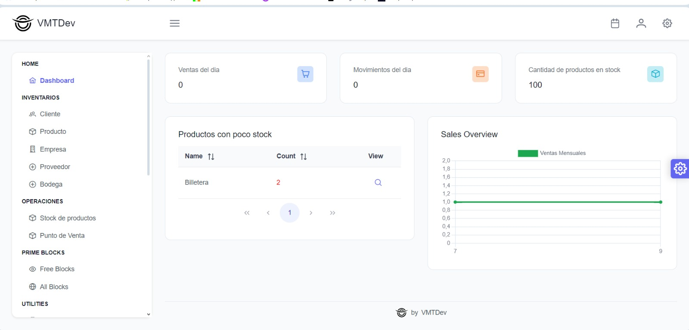
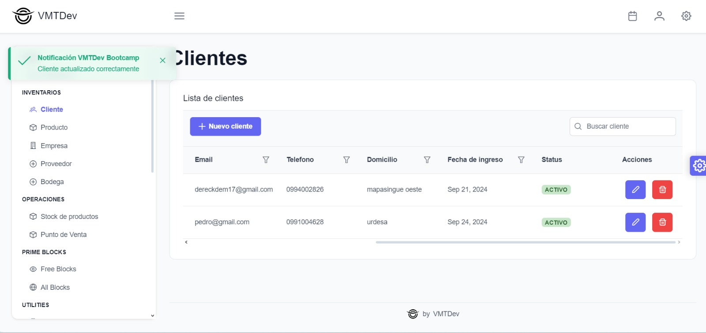

## Integrantes

- Carvallo Shelton
- Estrada Dereck
- Fonseca John
- Mejia Derek

### Dashboard

Para el Dashboard decidimos crear dos view, uno que tendria las ventas del dia, la cantidad de movimientos que hubo, el total de productos en stock y todos los productos con poco stock, otro view para poder cargar todo lo que es la cantidad de ventas que hubo en un mes.

### CRUDs

Para los cruds de bodega, empresa, stock, cliente, producto, proveedor se utilizo el form template para validar que la informacion requirada sea ingresada y que estos campos importantes no cuenten con algun valor null, debido a que algunos objetos tienen informacion de otras tablas se uso un modal con el objetivo de que se pueda buscar con mas precision el valor que se quiere.

A continuacion se mostraran imagenes de todas las pantallas con sus respectivas acciones.

### Bodega

#### Crear Bodega
 

#### Actualizar  Bodega
 

#### Eliminar  Bodega
 

### Producto

#### Crear Producto
 

#### Actualizar Producto
 

#### Eliminar Producto
 

### Proveedor

#### Crear Proveedor
 

#### Actualizar Proveedor
 

#### Eliminar Proveedor
 

### Empresa

#### Actualizar Empresa
 

#### Eliminar Empresa
 

#### Invalidar Empresa
 

### Cliente

#### Crear Cliente
 

#### Actualizar Cliente
 

#### Eliminar Cliente
 

#### Invalidar Cliente
 
 

### Stock

Para el registro de stock, fue necesario aplicar un filtro que verificara si un producto ya existía en una bodega específica, asegurándose de que dicha bodega perteneciera a una sucursal, y que esta sucursal formara parte de la misma empresa. De esta manera, se evita que el mismo producto sea registrado más de una vez en las mismas condiciones.

#### Invalidar Stock
 

#### Ingresar nueva cantidad stock
 

#### Stock Actualizado
 

### Dashboard Actualizado

 
